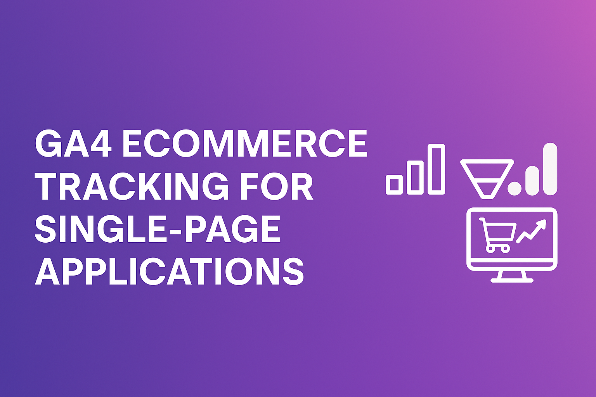
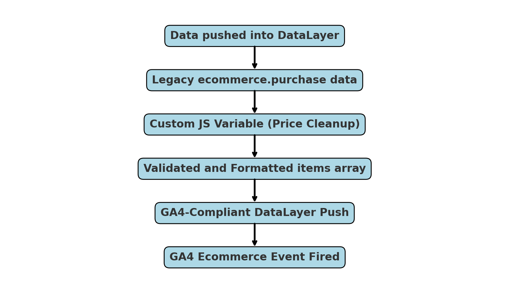
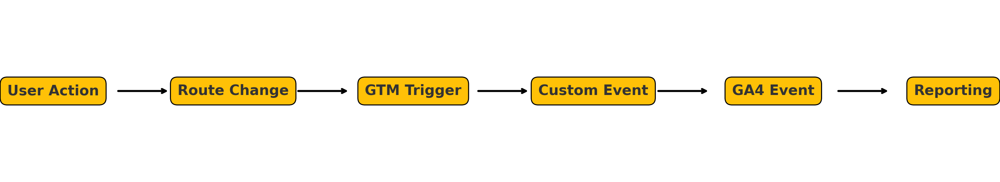

# GA4 Ecommerce Tracking for Single-Page Applications (SPA)

👋 Hi! I'm Megan Simmons — a business intelligence and marketing analytics professional with over a decade of experience designing full-funnel data solutions across web, CRM, and marketing ecosystems.

This project demonstrates how I implemented GA4 ecommerce tracking on a single-page application (SPA), resolving legacy script conflicts and restoring reliable event tracking through a two-phase approach: a **schema rebuild** and a **GTM-based interim workaround**.

⚠️ *This project is anonymized and uses mock data to protect company confidentiality.*

---

## 📈 Business Context

This project supported a high-traffic B2B ecommerce platform within the life sciences industry, where accurate product interaction and conversion tracking were essential for informing digital strategy, optimizing customer experience, and supporting high-value scientific transactions. Because the site was built as a single-page application (SPA), legacy analytics scripts failed to capture virtual page transitions and key ecommerce events—leading to **data loss, event duplication, and misalignment between spend and ROI**.

Maintaining accurate tracking across product views, checkout, and purchases was critical to support campaign optimization and budget allocation.

---

## 🧩 Tracking Challenges in SPAs

Traditional analytics scripts often fail on SPAs due to lack of full-page reloads. Key ecommerce events—like `add_to_cart` or `purchase`—were missed or misfired, and the GA4 ecommerce schema was corrupted by improperly structured `items` arrays.

Additionally, multiple legacy scripts (`analytics.js`, `gtag.js`) coexisted alongside GA4, compounding tracking conflicts.

---

## 🛠 Final Solution: Schema Cleanup & Rebuild

To future-proof tracking and eliminate legacy conflicts, I led a full overhaul of the analytics implementation:

- ✅ Removed Universal Analytics (`analytics.js`) and `gtag.js` scripts from all SPA routes  
- ✅ Rebuilt the ecommerce dataLayer using GA4’s recommended Enhanced Ecommerce schema  
- ✅ Aligned all events (`view_item`, `add_to_cart`, `begin_checkout`, `purchase`) to GA4 validation standards  
- ✅ Tested and validated across GA4 DebugView and Chrome DevTools  

### 🧠 Why It Mattered
- Reduced event duplication and inflated revenue reporting  
- Enabled clean, real-time ecommerce insights across the full customer journey  
- Created a scalable tagging framework for future expansion, including support for advanced event types such as cross-category product comparisons, buyer intent signals, and gated content engagement  

---

## 🔧 Short-Term Fix: GTM Workaround

Before the final code release, tracking had to be stabilized for a live campaign. I implemented a GTM-based workaround that:

- Parsed legacy data from `ecommerce.purchase.products`  
- Built a GA4-compliant `items` array using a Custom JS variable  
- Cleaned up price values (which were inflated by a factor of 1M)  
- Used Regex triggers to only fire tags when the schema was valid  
- Created a fallback event listener for manual `add_to_cart` schema correction  

This temporary patch preserved event integrity during the broken state and ensured data continuity for marketing analysis.

---

## ✅ Outcome & Impact

- 🔧 Restored GA4 tracking stability within 48 hours using GTM-based workarounds  
- 🧹 Fully deprecated legacy analytics scripts in the subsequent code release cycle  
- 🎯 Reestablished trust in ecommerce event data, enabling more reliable attribution, funnel insights, and cross-functional reporting  
- 🧱 Built a scalable, future-proof GA4 tagging framework to support advanced analytics and customer journey visibility  

---

## 🧰 Tech Stack

| Tool / Platform     | Purpose                                 |
|---------------------|------------------------------------------|
| Google Analytics 4  | Ecommerce tracking & schema alignment    |
| Google Tag Manager  | Event tagging & conditional triggers     |
| Chrome DevTools     | Event validation & debugging             |
| JavaScript & Regex  | Schema transformation & data fixes       |
| SPA Framework (React/Vue) | Frontend architecture context        |

---

## 📸 Project Diagrams

### GTM and GA4 Event Flowchart  

### SPA Event Tracking Flow  

---

## ❓ FAQ & Lessons Learned

**Q: What common issues arise when implementing GA4 on SPAs?**  
A: Event misfires, legacy script conflicts, and misconfigured `items` arrays are the most common.

**Q: How can I avoid tracking conflicts?**  
A: Fully audit and remove legacy scripts before implementing GTM-based GA4 tracking.

**Q: What are best practices for ecommerce tracking in GA4?**  
A: Always follow [Google’s Enhanced Ecommerce schema](https://developers.google.com/tag-platform/gtagjs/reference/events) and test using DebugView.

**Q: Where can I find GA4 ecommerce guidelines?**  
A: Google's official GA4 ecommerce documentation can be found [here](https://support.google.com/analytics/answer/9268036?hl=en).

---

## 📬 Contact

Feel free to connect with me on [LinkedIn](https://www.linkedin.com/in/iheartscience) or reach out if you're hiring for roles in analytics, product insights, or CRM strategy.

---
